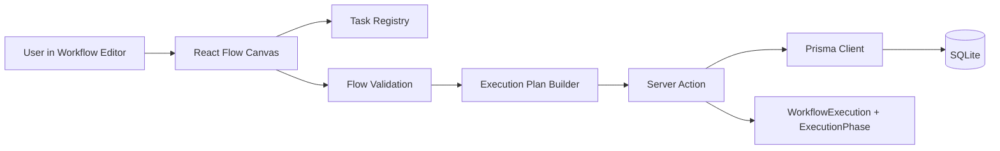
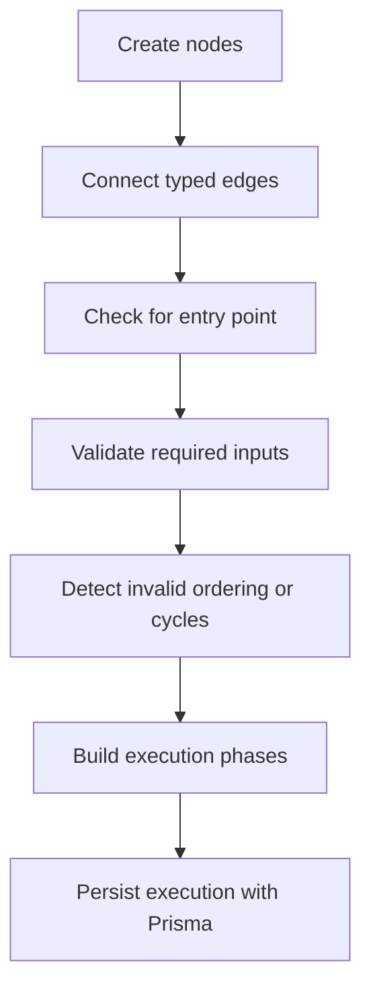

# Fluid Scrapping

> A visual workflow builder for scraping curiosity.
>
> This project is a small but honest answer to the question: _"How do these tools work under the hood?"_

`Fluid Scrapping` is a workflow-driven scraping playground built with Next.js, React Flow, Prisma, SQLite, and Clerk. Instead of hiding the moving parts, it leans into them: nodes, edges, validation, execution planning, persistence, and the UI that makes all of that feel tangible.

If you like learning by opening files and tracing behavior end to end, this repo is for you.

## Why This Project Exists

Most scraping tools feel magical until you try to build one.

This project turns that magic into visible pieces:

- a visual editor for composing scraping workflows
- a task registry that defines what each node can do
- an execution planner that validates graph order and missing inputs
- a Prisma + SQLite data layer that stores workflows and executions
- a Next.js App Router app that keeps the product structure easy to follow

## What You Can Explore Here

- Create workflows visually
- Connect task nodes with typed inputs and outputs
- Validate whether a flow is runnable
- Persist workflows and execution history
- Study a compact full-stack architecture without a lot of abstraction noise

Current tasks in the workflow registry:

- `Launch browser`
- `Get html from page`
- `Extract text from element`

## Architecture At A Glance



### Mental model

- UI layer: the editor, cards, dialogs, and workflow canvas
- Application layer: validation, task metadata, execution planning, server actions
- Data layer: `Workflow`, `WorkflowExecution`, and `ExecutionPhase`

## Tech Stack

- `Next.js 14` with App Router
- `React 18`
- `TypeScript`
- `@xyflow/react` for the visual workflow editor
- `Prisma` for type-safe database access
- `SQLite` for simple local persistence
- `Clerk` for authentication
- `Tailwind CSS` + shadcn/ui style components
- `TanStack Query` for client-side data tooling

## Project Walkthrough

Start here if you want the fastest path to understanding the codebase:

- [`app/workflows/editor/[workflowId]/page.tsx`](./app/workflows/editor/%5BworkflowId%5D/page.tsx) loads one workflow and hands it to the editor
- [`app/workflows/_components/Editor.tsx`](./app/workflows/_components/Editor.tsx) wires the top bar, task menu, and flow canvas
- [`app/workflows/_components/FlowEditor.tsx`](./app/workflows/_components/FlowEditor.tsx) handles drag/drop, edges, validation rules, and graph state
- [`lib/workflow/task/registry.tsx`](./lib/workflow/task/registry.tsx) is the central registry of available workflow tasks
- [`lib/workflow/task/LaunchBrowser.tsx`](./lib/workflow/task/LaunchBrowser.tsx) defines the entry-point task
- [`lib/workflow/task/PageToHtml.tsx`](./lib/workflow/task/PageToHtml.tsx) turns a page into HTML
- [`lib/workflow/task/ExtractTextFromElement.tsx`](./lib/workflow/task/ExtractTextFromElement.tsx) extracts text using a selector
- [`lib/workflow/executionPlan.ts`](./lib/workflow/executionPlan.ts) converts a graph into runnable phases
- [`actions/workflows/runWorkflow.ts`](./actions/workflows/runWorkflow.ts) validates and records a workflow execution
- [`prisma/schema.prisma`](./prisma/schema.prisma) defines the database models
- [`middleware.ts`](./middleware.ts) protects private routes with Clerk

## Interesting Reading From `🧅conceptchull`

This folder is part of what makes the repo fun. It captures the thinking behind the build in simple notes instead of hiding everything in code.

- [Open the full folder](./%20%F0%9F%A7%85conceptchull)
- [Project architecture](./%20%F0%9F%A7%85conceptchull/project-architecture.md)
- [Next.js App Router basics](./%20%F0%9F%A7%85conceptchull/next-js-app-router-basics.md)
- [Prisma basics](./%20%F0%9F%A7%85conceptchull/prisma-basics.md)
- [SQLite basics](./%20%F0%9F%A7%85conceptchull/sqlite-basics.md)

If you are curious about how the app is shaped under the hood, read those alongside the code tour above.

## Local Setup

### Prerequisites

- `Node.js 20+` recommended
- `npm` (this repo already includes `package-lock.json`)
- A Clerk application for auth keys

### 1. Install dependencies

```bash
npm install
```

### 2. Create your environment file

Create a `.env` file in the project root with at least:

```env
NEXT_PUBLIC_CLERK_PUBLISHABLE_KEY=your_clerk_publishable_key
CLERK_SECRET_KEY=your_clerk_secret_key
NEXT_PUBLIC_DEV_MODE=false
```

Notes:

- `NEXT_PUBLIC_DEV_MODE=true` will show React Flow node ids in the editor
- SQLite uses the local database file configured in [`prisma/schema.prisma`](./prisma/schema.prisma), so you do not need a separate database server for local development

### 3. Apply database migrations

```bash
npx prisma migrate dev
```

This will create the local SQLite database file and apply the existing schema.

### 4. Start the app

```bash
npm run dev
```

Open `http://localhost:3000`

## Setup

1. Install Node.js.
   Recommended: install it from `https://nodejs.org` or with Homebrew using `brew install node`.
2. Clone the repo.
3. Open the project in Terminal.
4. Run `npm install`.
5. Create the `.env` file with your Clerk keys.
6. Run `npx prisma migrate dev`.
7. Run `npm run dev`.
8. Visit `http://localhost:3000`.

## Database Notes

- The app currently uses SQLite for simplicity and learning speed
- Prisma is the abstraction layer you work with in TypeScript
- The database models live in [`prisma/schema.prisma`](./prisma/schema.prisma)
- Migrations live in [`prisma/migrations`](./prisma/migrations)

Core models:

- `Workflow`
- `WorkflowExecution`
- `ExecutionPhase`

## How The Workflow Engine Thinks



That logic mostly lives in:

- [`lib/workflow/executionPlan.ts`](./lib/workflow/executionPlan.ts)
- [`lib/workflow/task/registry.tsx`](./lib/workflow/task/registry.tsx)
- [`actions/workflows/runWorkflow.ts`](./actions/workflows/runWorkflow.ts)

## Folder Map

```text
app/                 Next.js routes, layouts, pages, editor screens
actions/             Server actions for workflow CRUD and execution
components/          Shared UI and editor components
lib/workflow/        Workflow creation, task definitions, execution planning
prisma/              Schema and migrations
 🧅conceptchull/     Notes that explain the project’s building blocks
```

## Contributing

Open an issue, start a discussion, or send a PR if you want to improve:

- task definitions
- workflow execution behavior
- editor UX
- README/docs
- learning notes in `🧅conceptchull`

Small, clear contributions are very welcome.

## For Curious Builders

If you have ever wanted to understand how a visual automation or scraping builder is assembled, this repo is a good place to slow down and inspect each layer.

Not just _what_ it does.

Also _why_ it needs to exist in that shape.
